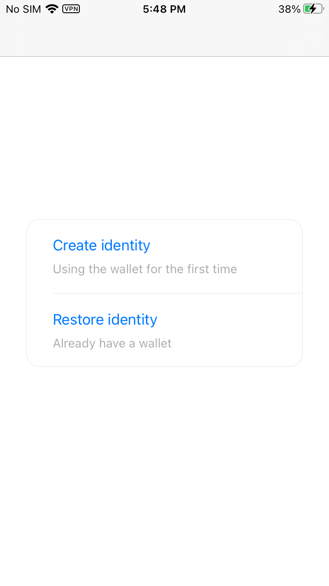
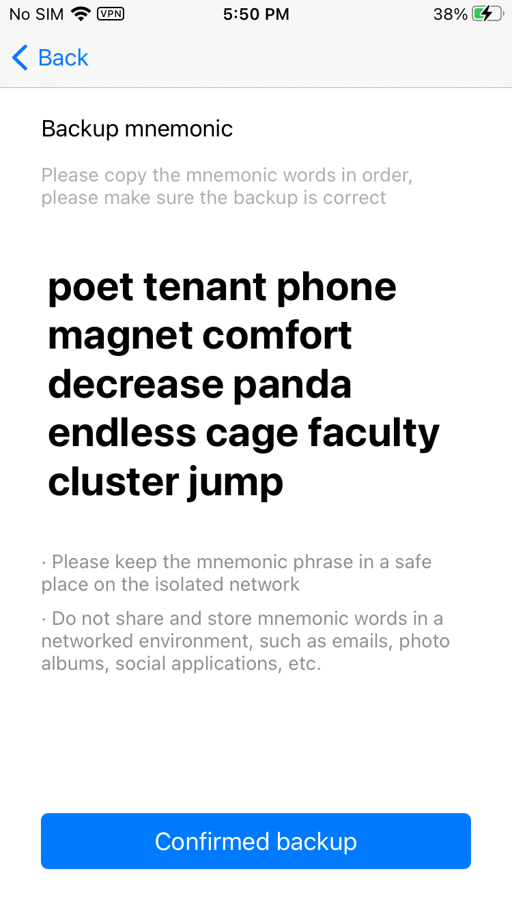
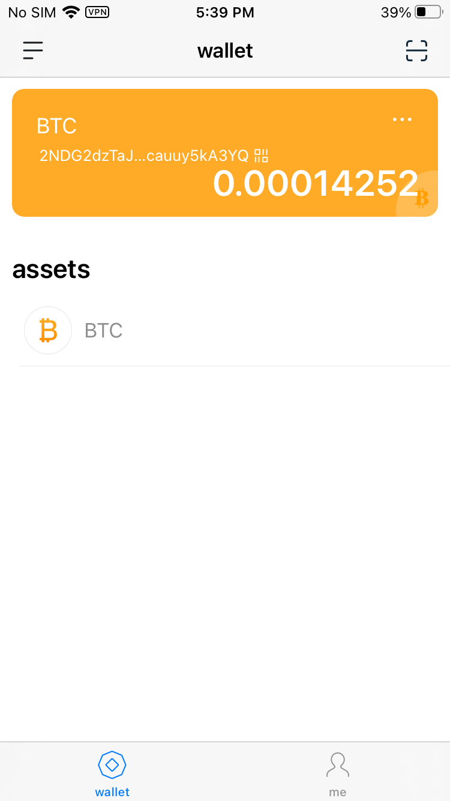
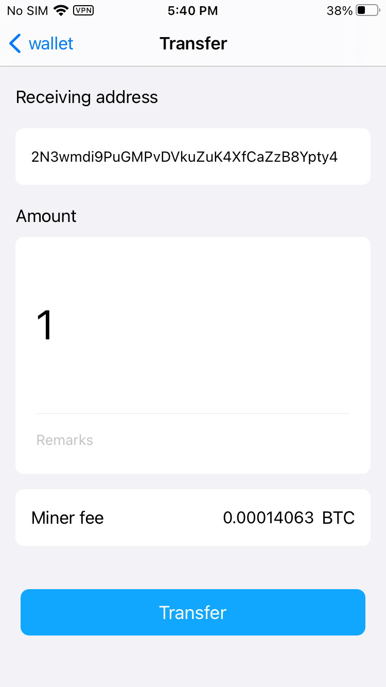
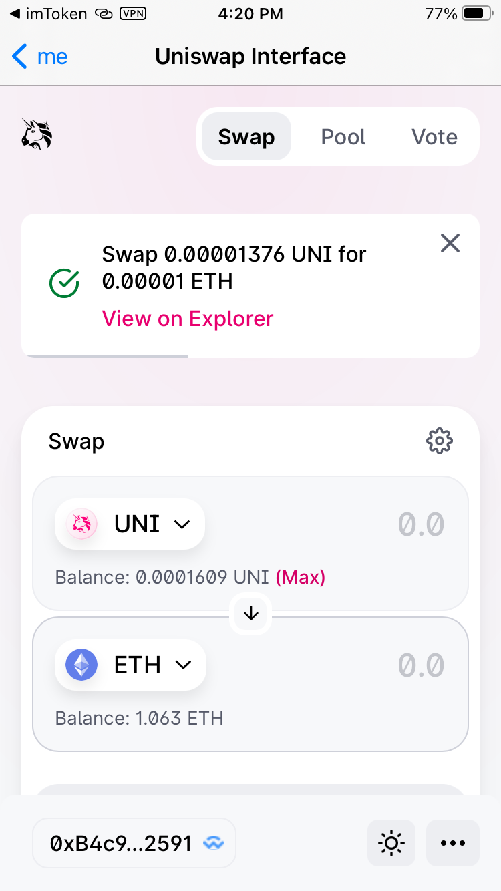

# BlockChainWallet
This is a blockchain wallet, which imitates imToken and integrates the core code of [imToken open source](https://github.com/consenlabs/token-core-ios).  
You can use this APP to test the transaction of BTC or ETH on testnet or mainnet.  

## Feature
- Generate wallet by mnemonic
- Transfer BTC, ETH, HT, BNB on mainNet or testNet
- DApp browser(realized by [WalletConnect Protocol](https://walletconnect.org/))

## Installation and Run the Example   
I've already uploaded all files, just download and run it.  

## Try the APP
### Create new Identity and backup mnemonic words
            

### Use Faucet to get test coins and check the balance on home page
BTC faucet:  
https://coinfaucet.eu/en/btc-testnet/  
ETH faucet:  
https://faucet.kovan.network/  
Omni Token faucet:  
Please transfer some Bitcoin test coins to the address "moneyqMan7uh8FqdCA2BV5yZ8qVrc9ikLP", and then after the transaction is confirmed, there will be some omni on your address, and the conversion ratio is 1 BTC = 100 OMNI.  

### Transfer test and check the transaction result on explore
BTC explore:  
https://live.blockcypher.com/btc-testnet/  
ETH explore:  
https://kovan.etherscan.io/  

### DApp browser(example: Uniswap)

## Troubleshooting
If you use pod to re-import third-party frameworks, the bigInt framework will have problems due to version reasons, please follow the simulator prompts to modify the code.  

## TODO
- [ ] Switch address mode(Legal address or Segwit address)
- [ ] Import wallet from mnemonic words
- [ ] Import BTC wallet from WIF
- [ ] Import ETH wallet from private key
- [ ] Import ETH wallet from keystore
- [ ] Select or custom miner fee for different transaction speed
- [ ] Backup mnemonic words
- [ ] Scan code
- [ ] Derive subAddress

## Thanks and more info
Thanks imToken open source.

